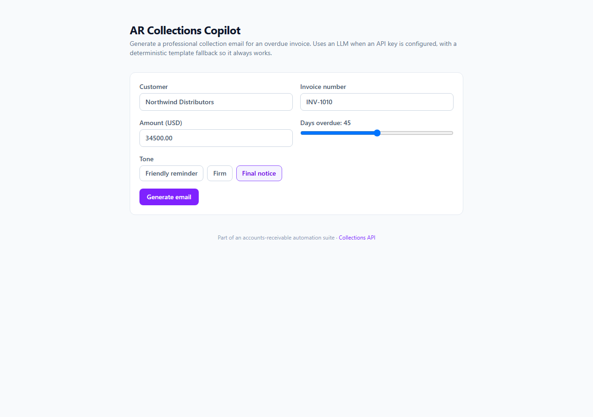

<!-- ══════════════════════════ TÍTULO ══════════════════════════ -->
<div align="center">
  
</div>

<br/>

<!-- ══════════════════════ IDIOMAS / LANGUAGES ══════════════════════ -->
<div align="center">
<a href="README.md"></a>
<a href="README.en.md"></a>
<a href="README.es.md"></a>
</div>

<br/>

<div align="center">


</div>

<div align="center">
<a href="#sobre"></a>
<a href="#funcionalidades"></a>
<a href="#como-funciona"></a>
<a href="#uso"></a>
</div>

<br/>

> 💡 **Funciona com ou sem chave de LLM.** Sem `ANTHROPIC_API_KEY`/`OPENAI_API_KEY`, cai automaticamente num gerador de template determinístico.

<div align="center">
  
</div>

## Sobre

**AR Collections Copilot** gera e-mails de cobrança profissionais e com o tom apropriado para faturas em atraso. Chama um **LLM** (Anthropic ou OpenAI) quando há chave configurada, e cai para um gerador de template determinístico caso contrário — então sempre produz um rascunho utilizável, online ou offline.

## Funcionalidades

- Campos de entrada para cliente, número da fatura, valor e dias em atraso.
- Seleção de tom (amigável / firme / final), sugerido automaticamente pelo atraso da fatura.
- Cópia com um clique do assunto + corpo gerados.
- Cliente de LLM agnóstico de provedor, com fallback gracioso.

## Como Funciona

`POST /api/draft` recebe o contexto da fatura e o tom, tenta `llmDraft()` (chamada agnóstica de provedor para Anthropic/OpenAI retornando JSON), e cai para `templateDraft()` quando não há chave configurada ou a chamada falha.

## Uso

```bash
npm install
npm run dev      # http://localhost:3000
```

Opcional — habilitar um LLM de verdade definindo uma das variáveis:
```bash
ANTHROPIC_API_KEY=...      # ou OPENAI_API_KEY=...
LLM_MODEL=...              # override opcional do modelo
```
Sem chave, o gerador de template é usado.

## Licença

[MIT](LICENSE).

<div align="center">
  
</div>

<p align="center"><sub>Desenvolvido por <strong><a href="https://github.com/geoggrigori">Grigori</a></strong> · 2026</sub></p>
